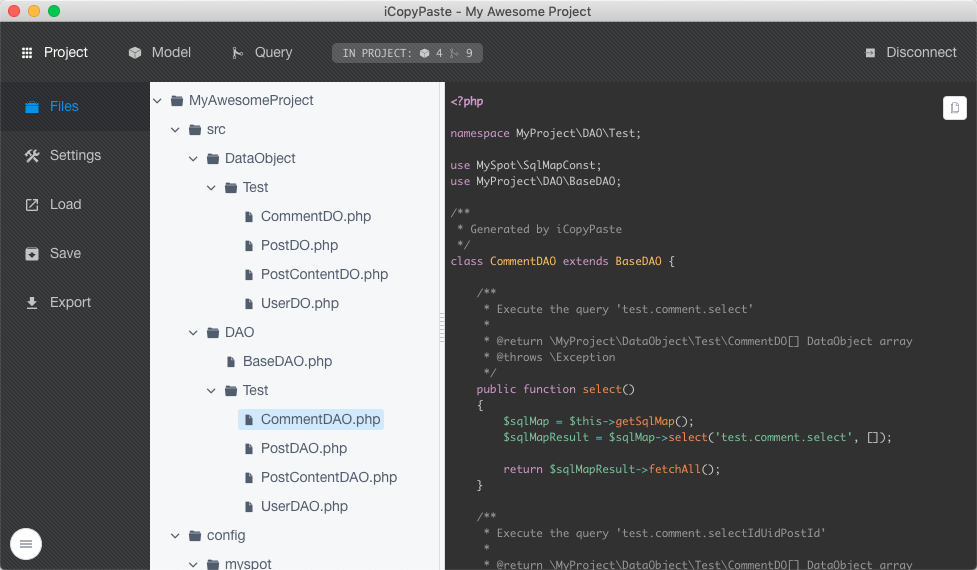

# iCopyPaste


一个可视化 SQL 映射代码以及 DAL 数据库访问层的代码生成工具, 目前主要适配 [MySpot](https://github.com/vimac/myspot), 一个支持 SQL Map 的 PHP 数据库访问层的框架

未来准备加入 MyBatis + Java 支持

使用 Electron + Vue + iView + Sequelize 构建, 在 Electron 的支持下, 它可以在 **Windows**, **macOS**, **Linux** 上运行



#### 下载

前往 https://github.com/vimac/iCopyPaste/releases 获取最新版本

#### 动机

我知道市场上已经有很多类似的数据库代码生成工具，但是问题是:
 
* 它们都不是我写的 :)
* 它们都不会支持 ["MySpot"](https://github.com/vimac/myspot/) (这个工具一开始的初衷是为它准备的)

#### 本地编译环境

``` bash
# install dependencies
yarn

# serve with hot reload at localhost:9080
yarn run dev

# build electron application for production
yarn run build

# lint all JS/Vue component files in `src/`
yarn run lint

```

#### License

[MIT License](LICENSE)

#### 关于我

一个爱好摄影的开发者, 可以访问我的主页 [vifix.cn](https://vifix.cn) 了解更多

---

关于 [electron-vue] 的使用和工程结构请看 https://github.com/SimulatedGREG/electron-vue
